<p align="center">
  
</p>

<h1 align="center">Tartinou</h1>

<p align="center">
  L'application du foyer : dépenses du jour, menus de la semaine, liste de courses, stock alimentaire scanné, et un fil pour partager entre foyers.<br>
  PWA sans framework, serveur Node sans dépendance, tout en base de données.
</p>

<p align="center">
  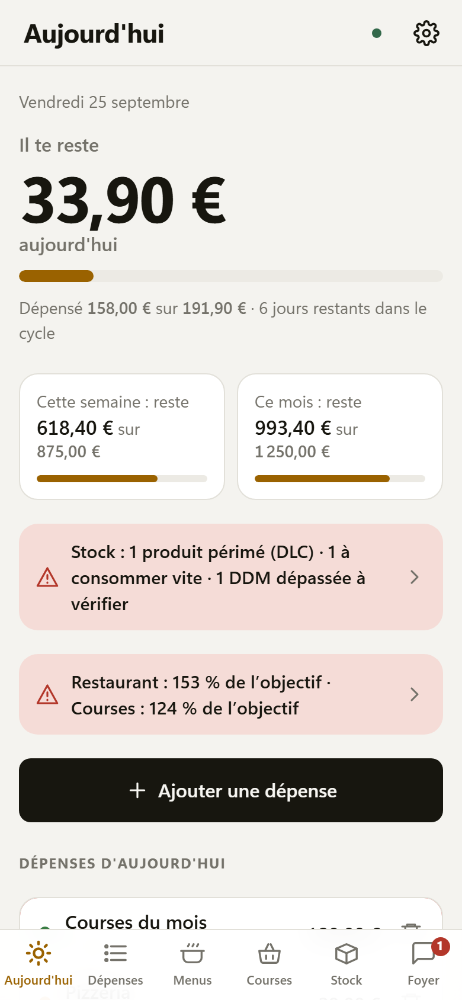
  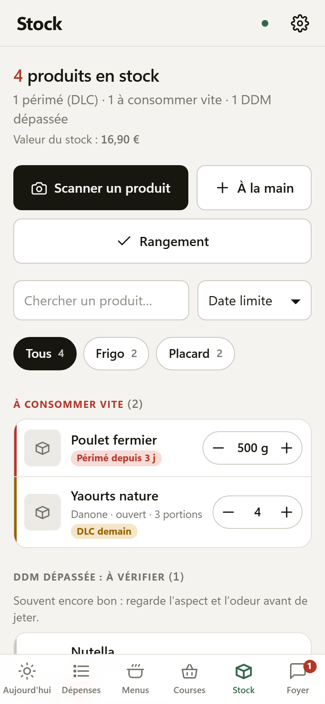
  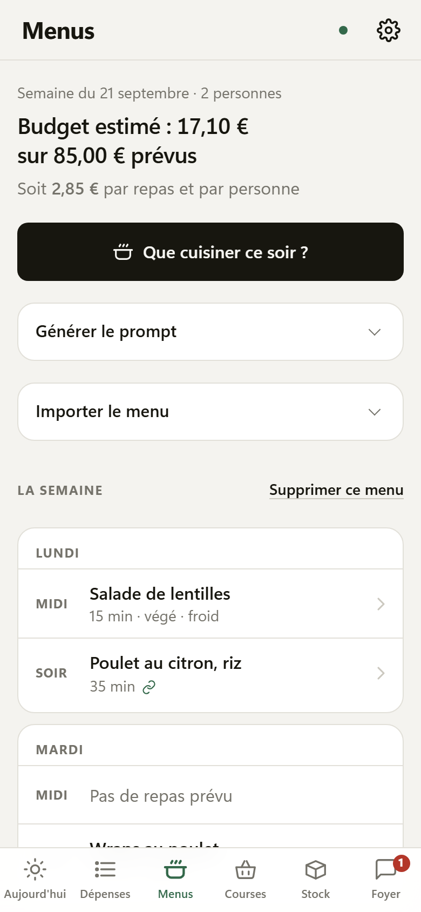
  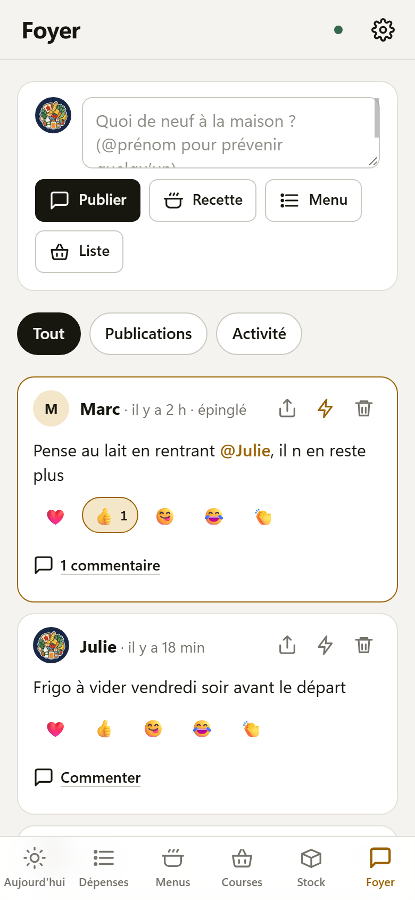
</p>

---

## Sommaire

1. [En bref](#en-bref)
2. [Les écrans](#les-écrans)
3. [Comptes, foyers et temps réel](#comptes-foyers-et-temps-réel)
4. [Notifications](#notifications)
5. [Tout se règle](#tout-se-règle)
6. [Architecture](#architecture)
7. [Lancer en local](#lancer-en-local)
8. [Déployer sur un serveur](#déployer-sur-un-serveur)
9. [API](#api)
10. [Structure du code](#structure-du-code)
11. [Design](#design)
12. [Sauvegarde et données](#sauvegarde-et-données)

---

## En bref

Tartinou réunit dans une seule application installable sur le téléphone (et confortable sur PC) :

| | |
|---|---|
| **Budget** | Un reste à dépenser par jour, calculé sur le cycle de paie, avec catégories et objectifs. |
| **Menus** | Un prompt prêt à coller dans Claude, qui tient compte du stock et de ce qui périme ; le menu revient en JSON et s'importe en un geste. Chaque recette a un lien en ligne. |
| **Courses** | Liste par rayon, générée depuis le menu, validée avec le ticket, rangée dans le stock. |
| **Stock** | Scan des codes-barres, fiche Open Food Facts (Nutri-Score, allergènes), DLC et DDM, prix par magasin, anti-gaspi en euros. |
| **Communauté** | Un fil commun à tous les utilisateurs du serveur et un mur privé par foyer : messages, recettes, menus, listes partagés, réactions, commentaires, mentions. |
| **Comptes** | Inscription, connexion, foyers avec code d'invitation, photo de profil, une base SQLite par foyer. |

Sans framework ni bundler côté client, sans dépendance npm côté serveur. Node ≥ 22.13 suffit.

---

## Les écrans

### Connexion et inscription

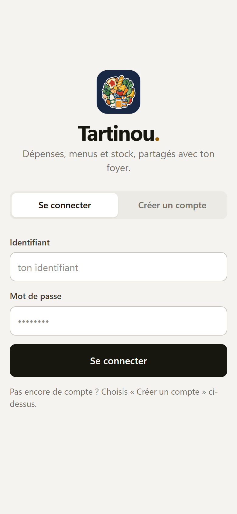

- Le premier compte du serveur crée son foyer librement.
- Ensuite, on **rejoint un foyer** avec son code d'invitation (partageable par lien), ou on en crée un nouveau avec le code du serveur.
- Mot de passe haché avec scrypt, sessions en base, limitation des tentatives par adresse.

<br clear="all">

### Aujourd'hui


- **Reste à dépenser** du jour, de la semaine, du mois, avec la jauge du cycle.
- Alertes : produits à consommer aujourd'hui ou bientôt, objectifs de catégorie à 80 % et 100 %.
- Aperçu du mur du foyer et des derniers partages.
- Raccourcis : ajouter une dépense, scanner un produit, « Que cuisiner ce soir ? ».

<br clear="all">

### Dépenses

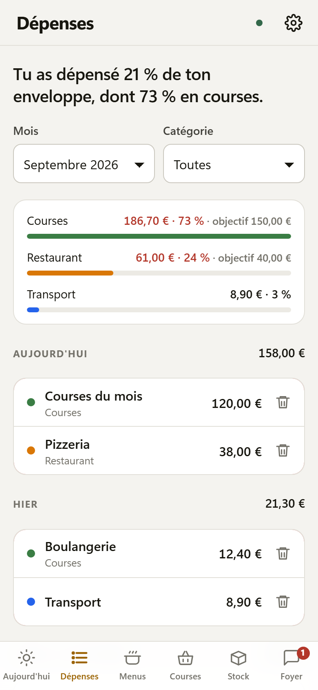

- Saisie au pavé numérique, catégorie en un tap, auteur de la dépense quand on est plusieurs.
- **Objectifs par catégorie** sur le cycle : orange à 80 %, rouge au-delà.
- **Charges fixes** et **dépenses récurrentes** détectées et proposées.
- **Import d'un relevé bancaire CSV** avec rapprochement des dépenses déjà saisies.
- Bilan de la semaine et du mois, aussi en notification.

<br clear="all">

### Menus


- **Prompt pour Claude** : nombre de convives, objectif (équilibré, économique, rapide, batch cooking…), niveau, équipement, allergènes du foyer, stock et produits urgents, « restes d'abord », recettes favorites à replacer.
- Le prompt exige pour **chaque recette un lien direct** vers la page d'une recette précise (Marmiton, 750g, Cuisine AZ…), trouvée et vérifiée sur le web par l'IA ; les liens de recherche et les adresses inventées sont interdits. Le lien est cliquable dans l'app ; si un repas arrive quand même sans lien direct, l'app propose une recherche à la place.
- Import du JSON validé strictement ; les menus et repas importés se **suppriment** individuellement ou par semaine.
- **« Que cuisiner ce soir ? »** : une recette à partir de ce qui périme.
- Fiche recette : convives ajustables (quantités recalculées), **« J'ai cuisiné ce plat »** retire les ingrédients du stock, favoris remis au menu en un geste, partage au foyer ou à tout le monde.

<br clear="all">

### Courses

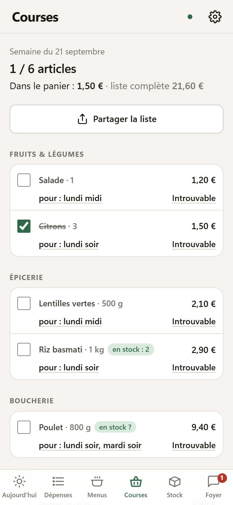

- Liste **par rayon**, générée depuis le menu de la semaine, complétée à la main.
- Les articles déjà **en stock** sont signalés ; les produits « à racheter » (marqués depuis le stock) arrivent tout seuls.
- Validation avec le ticket : montant, magasin, puis **« Ranger les courses »** place chaque article dans le frigo, le congélateur ou le placard avec sa date limite.
- Liste partageable en texte ou sur le fil du foyer.

<br clear="all">

### Stock


- **Scan** : caméra (BarcodeDetector natif, ZXing en secours), photo, saisie manuelle, ou étiquettes QR maison pour les produits sans code-barres.
- **Open Food Facts** remplit nom, marque, image, **Nutri-Score** (pastille colorée dans la liste), Eco-Score, allergènes. Sans code-barres, taper le nom du produit propose les correspondances Open Food Facts : un tap remplit la fiche.
- **DLC et DDM** distinguées : une DLC dépassée se jette, une DDM dépassée se goûte. Tri par urgence, filtres par emplacement.
- **Prix par magasin** avec historique : « plus cher que la dernière fois ».
- **Allergènes du foyer** signalés sur les produits, **portions restantes**, quantité au stepper.
- **Mode rangement** : inventaire guidé produit par produit.
- **Anti-gaspi** : « Jeté ? » avec raison, journal, statistiques sur six mois, **euros gaspillés**.
- **Étiquettes QR** à imprimer pour les bocaux et le congélateur.

<br clear="all">

### Communauté


Deux portées, en un seul écran :

- **Tout le monde** : un fil commun à **tous les utilisateurs du serveur**, quel que soit leur foyer. On y publie un message, une recette, un menu, une liste de courses.
- **Mon foyer** : le mur privé du foyer, avec les petits mots épinglés et le **fil d'activité** (qui a ajouté, jeté, cuisiné, dépensé).

Depuis une fiche recette, la liste de courses ou la fiche d'un produit du stock, **« Publier »** envoie l'élément dans le fil, pour tout le monde ou pour le foyer, avec un mot d'accompagnement. Un produit partagé s'ajoute au stock d'un autre foyer en un geste.

Le bouton **Membres** liste tous les comptes du serveur groupés par foyer, avec la présence en ligne et un raccourci pour mentionner quelqu'un.

Sur les deux : **réactions** (❤️ 👍 😋 😂 👏), **commentaires**, **mentions** `@prénom` qui notifient la personne, suppression par l'auteur, badge de non-lus sur l'onglet Communauté. Une recette partagée s'ajoute aux favoris ou au menu en un geste ; chaque recette a aussi une **page publique** `/p/r/<id>` importable par lien.

<br clear="all">

### Réglages

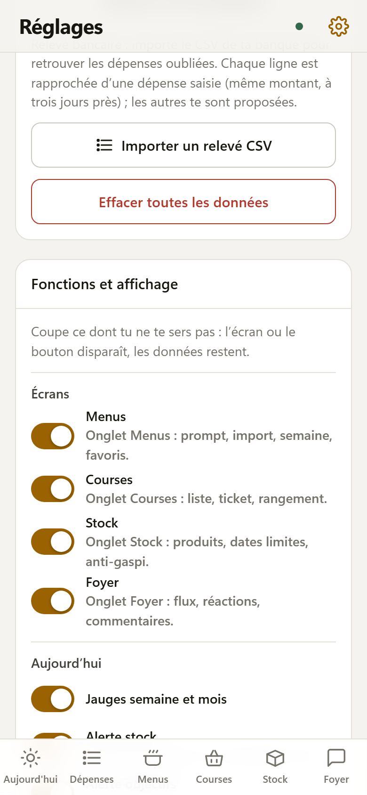

- Budget et cycle de paie, charges fixes et récurrences, catégories et objectifs, allergènes du foyer.
- Stock : emplacements, seuils d'alerte, magasins.
- Notifications : heure, contenus, appareils abonnés.
- Compte et foyer : **photo de profil**, mot de passe, membres, code d'invitation, quitter le foyer.
- Sauvegarde : export et import JSON, import CSV bancaire.
- **Fonctions et affichage** : chaque module se désactive (voir plus bas).
- Thème clair, sombre ou système.

<br clear="all">

### Mode sombre et PC

<p>
  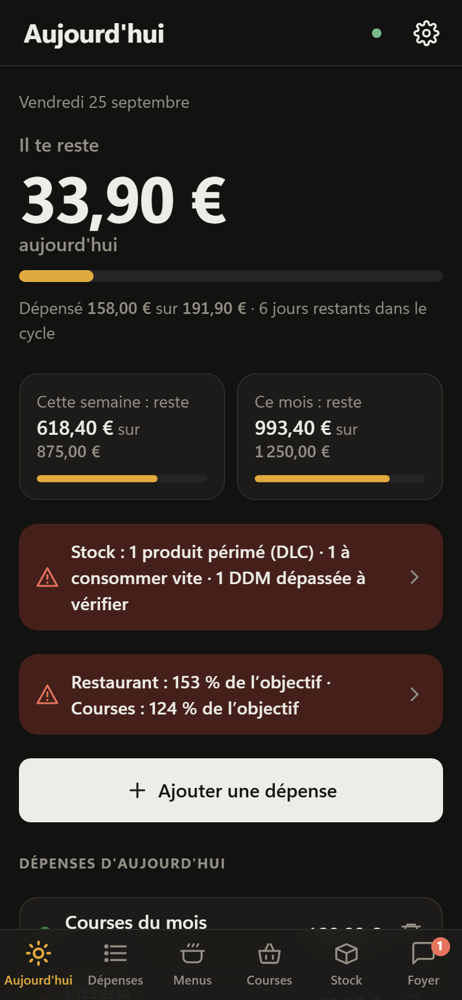
  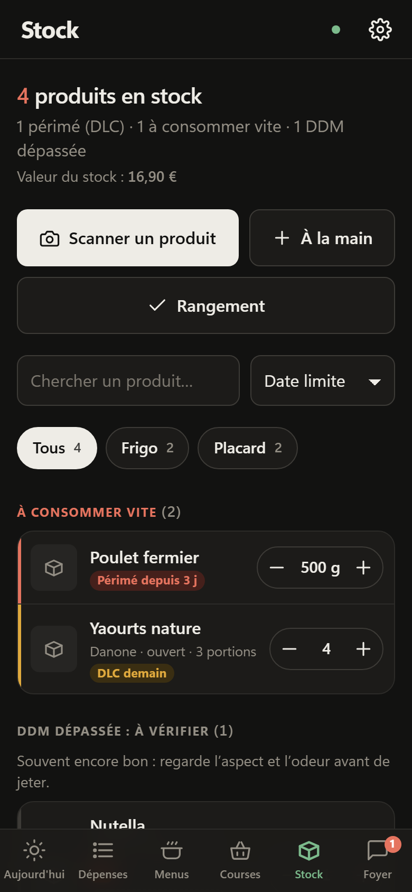
</p>

Au-delà de 900 px, la navigation passe dans une barre latérale avec le logo et le mot-symbole ; au-delà de 1180 px, les écrans qui s'y prêtent passent sur deux colonnes.

<p>
  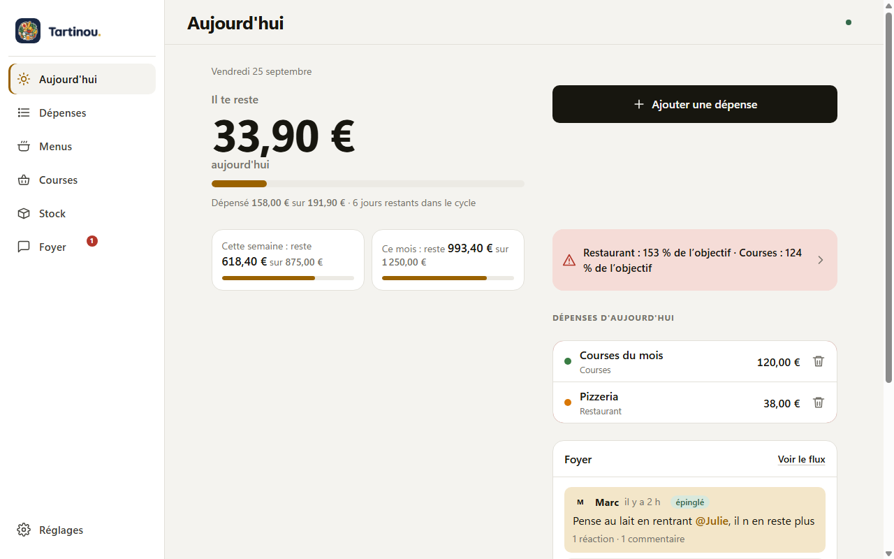
  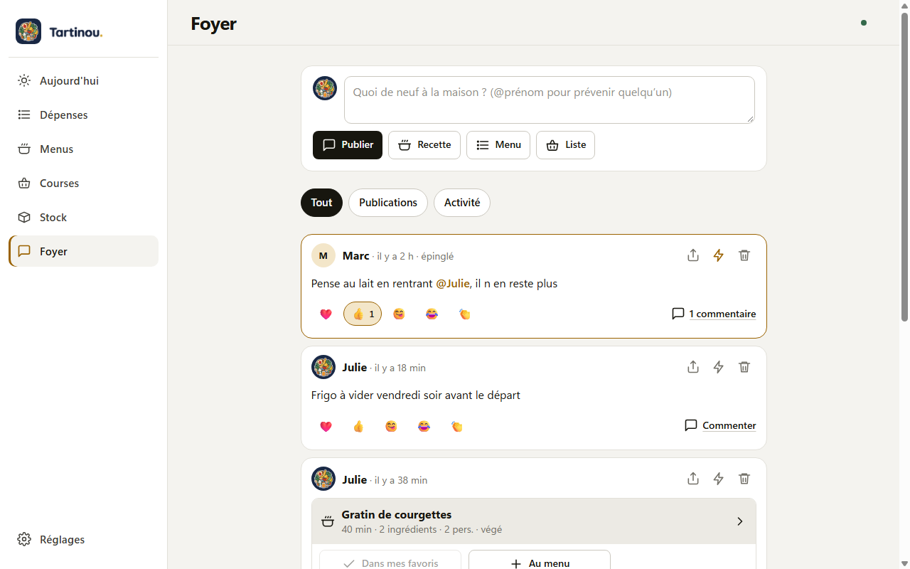
</p>

---

## Comptes, foyers et temps réel

- Un **compte** = identifiant, prénom affiché, mot de passe, photo de profil facultative.
- Un **foyer** = les personnes qui partagent les mêmes données. Chaque foyer possède **sa propre base SQLite** (`foyers/<id>.db`) ; les comptes, sessions et le fil communauté vivent dans `accounts.db`.
- L'administrateur du foyer voit le code d'invitation, peut le régénérer et retirer un membre.
- Le téléphone garde une copie locale (`localStorage`) pour démarrer instantanément et fonctionner **hors ligne** ; les modifications faites sans réseau partent à la reconnexion.
- Les autres appareils du foyer se mettent à jour **en direct** (Server-Sent Events), y compris le fil communauté et la liste des membres.

## Notifications

Web Push implémenté à la main (VAPID ES256, chiffrement aes128gcm), sans dépendance :

- dates limites du jour, chaque matin à l'heure choisie ;
- bilan **hebdomadaire** le dimanche et **mensuel** en fin de cycle ;
- objectifs de catégorie à 80 % et 100 % ;
- petits mots du foyer, mentions, réactions et commentaires sur tes publications.

Chaque appareil s'abonne séparément et choisit ses contenus.

## Tout se règle

Dans **Réglages → Fonctions et affichage**, chaque module a son interrupteur et les onglets inutiles disparaissent : menus, courses, stock, communauté, mur, fil d'activité, partages, prompt et liens de recettes, Nutri-Score, prix et historique, allergènes, portions, étiquettes QR, mode rangement, anti-gaspi, notifications, import CSV, récurrences, objectifs…

---

## Architecture

```
┌──────────────────────────────┐        HTTPS         ┌──────────────────────────────────────┐
│  Navigateur (PWA)            │ ◄──────────────────► │  nginx                                │
│  index.html · app.js         │                      │   /        fichiers statiques         │
│  js/store.js  (cache local,  │   /api/  ─────────►  │   /api/    proxy → Node 127.0.0.1:3311│
│   file d'attente, SSE)       │   /api/events (SSE)  │   /p/      pages publiques (recettes) │
│  sw.js (cache hors ligne)    │                      └──────────────┬───────────────────────┘
└──────────────────────────────┘                                     │
                                                       ┌─────────────▼───────────────────────┐
   Open Food Facts (code-barres)                       │  server/index.js  (node:http)        │
   jsDelivr (ZXing, qrcode)                            │   auth · state · events · community  │
                                                       │   push · planificateur (5 min)       │
                                                       │  server/db.js   → foyers/<id>.db     │
                                                       │  server/auth.js → accounts.db        │
                                                       └──────────────────────────────────────┘
```

- **Client** : modules ES natifs, un petit `h()` pour construire le DOM, routeur par `#hash`, une feuille de style. Aucun build.
- **État** : `js/store.js` garde les collections (`settings`, `categories`, `expenses`, `menus`, `promptForm`, `recettes`, `stock`, `posts`), un cache `localStorage` et une file d'attente par collection ; `PUT /api/state` n'envoie que ce qui a changé.
- **Serveur** : `node:http` + `node:sqlite` (mode WAL), zéro dépendance. Un planificateur passe toutes les cinq minutes pour les notifications.

---

## Lancer en local

Node ≥ 22.13 (SQLite intégré). Aucune installation.

```
npm start
# → http://127.0.0.1:3311   (base dans ./data/, premier compte libre)
```

Le serveur sert aussi les fichiers de l'app. Pour le rendu mobile, utilise l'émulation d'appareil du navigateur (390 px). La caméra exige HTTPS ou `localhost`.

Variables utiles : `PORT` (3311), `HOST` (127.0.0.1), `FOYER_DB` (chemin de référence, les bases vivent à côté), `FOYER_TOKEN` (code serveur pour créer d'autres foyers ; `npm run token` en génère un), `FOYER_INSCRIPTION=ouverte` pour laisser créer des foyers sans code, `FOYER_STATIC=0` pour ne servir que l'API, `TZ_APP` (Europe/Paris) pour l'heure des notifications, `FOYER_PUSH_SUBJECT` (`mailto:` pour VAPID). Les clés VAPID sont générées au premier démarrage et gardées dans `accounts.db`.

## Déployer sur un serveur

Exemple avec nginx et systemd (fichiers fournis dans `server/`). Le service Node écoute sur 127.0.0.1:3311, les données vivent dans `/var/lib/foyer/`.

```
# 1. Fichiers
tar czf - --exclude=docs --exclude=data index.html styles.css app.js manifest.json sw.js README.md package.json js icons scripts server \
  | ssh root@mon-serveur 'mkdir -p /var/www/life && tar xzf - --no-same-owner -C /var/www/life'

# 2. Première installation seulement : service, code d'accès, nginx
ssh root@mon-serveur '
  mkdir -p /var/lib/foyer && chown www-data:www-data /var/lib/foyer
  [ -f /etc/foyer.env ] || echo "FOYER_TOKEN=$(node /var/www/life/server/index.js --make-token)" > /etc/foyer.env
  chmod 600 /etc/foyer.env
  cp /var/www/life/server/foyer.service /etc/systemd/system/foyer.service
  systemctl daemon-reload && systemctl enable --now foyer
  cp /var/www/life/server/nginx-life.conf /etc/nginx/sites-available/life && nginx -t && systemctl reload nginx'

# 3. Mises à jour suivantes : étape 1, puis
ssh root@mon-serveur 'systemctl restart foyer'
```

À chaque déploiement, incrémente `VERSION` dans `sw.js` pour que les appareils installés récupèrent les nouveaux fichiers. Adapte `server_name` dans `server/nginx-life.conf` et le certificat (Let's Encrypt).

---

## API

Toutes les routes sauf `health`, `auth/register`, `auth/login` et `public/*` exigent `Authorization: Bearer <jeton de session>`.

| Route | Rôle |
|---|---|
| `GET /api/health` | État du service : nombre de foyers, mode d'inscription, premier compte ou non. |
| `POST /api/auth/register` | `{ login, nom, password, codeInvitation }` ou `{ …, nomFoyer, codeServeur }`. |
| `POST /api/auth/login` · `logout` · `password` | Session, déconnexion, changement de mot de passe. |
| `POST` / `DELETE /api/auth/avatar` | Photo de profil (JPEG 128 px en data URL). |
| `GET /api/me` | Compte, foyer (membres, avatars, code d'invitation pour l'administrateur), clé push, appareils. |
| `POST /api/foyer` | `{ nom }` renomme, `{ nouveauCode: true }` régénère le code d'invitation. |
| `DELETE /api/members/:id` | Retire un membre (administrateur). |
| `GET /api/state` | L'état complet du foyer. |
| `PUT /api/state` | `{ expenses: […], stock: {…} }` : chaque collection présente remplace la sienne, en transaction ; les autres appareils reçoivent un événement. |
| `GET /api/events?token=…` | Flux SSE : `state` (collections écrites), `membres`, `community`. |
| `GET /api/community` | Le fil commun (publications, réactions, commentaires). |
| `GET /api/community/membres` | Tous les comptes du serveur, avec foyer et présence en ligne. |
| `POST /api/community` | Publie un message, une recette, un menu ou une liste. |
| `POST /api/community/:id/react` · `comment` | Réaction (bascule) et commentaire. |
| `DELETE /api/community/:id` · `/comment/:cid` | Suppression par l'auteur. |
| `GET /api/public/recette/:id` · `GET /p/r/:id` | Recette partagée en JSON, et sa page HTML importable. |
| `GET /api/push/key` · `POST` / `DELETE /api/push/subscribe` · `POST /api/push/test` | Web Push. |
| `POST /api/reset` | Vide la base du foyer (administrateur). |

Tables par foyer : `settings`, `charges_fixes`, `prompt_form`, `categories`, `expenses`, `menu_weeks`, `manual_items`, `recipes`, `stock_items`, `products`, `stock_journal`, `a_racheter`, `price_history`, `posts`, `push_subscriptions`, `push_log` (voir `server/db.js`). Comptes : `foyers`, `users`, `sessions`, `push_config`, `community_posts` dans `accounts.db`.

---

## Structure du code

```
index.html  styles.css  app.js  manifest.json  sw.js
js/
  store.js        état, cache local, file d'attente, synchronisation, SSE
  api.js          client HTTP et session        push.js      abonnement Web Push
  modules.js      interrupteurs de fonctions    avatar.js    photo de profil
  budget.js       reste à dépenser              finance.js   récurrences, objectifs, CSV
  menu-schema.js  prompt et validation du menu  planning.js  placer une recette dans la semaine
  stock.js        modèle du stock, dates, journal, anti-gaspi
  off.js          Open Food Facts               scanner.js   caméra et codes-barres
  social.js       mur, réactions, mentions      community.js fil commun (API)
  share.js        partages texte et liens       qr.js        étiquettes QR
  screens/        today, expenses, menus, shopping, stock, foyer, settings, login
  components/     jauge, feuilles de saisie, recette, fiche produit, « Ranger les courses »,
                  « Jeté ? », mode rangement, « J'ai cuisiné », « Que cuisiner ce soir ? », mur
server/
  index.js        HTTP, API, SSE, communauté, planificateur
  db.js           schéma et lecture/écriture SQLite par foyer
  auth.js         comptes, foyers, sessions, fil communauté
  webpush.js      VAPID et chiffrement Web Push  notify.js   messages planifiés
  foyer.service   nginx-life.conf
docs/
  captures/       captures d'écran             PLAN-STOCK.md  plan détaillé du stock
```

## Design

Une seule feuille de style. Police système, fond papier et encre, un accent par domaine (budget ocre, cuisine vert), chiffres tabulaires, listes groupées à filets fins, feuilles basses pour la saisie. Thème clair et sombre suivent le système ou se forcent dans les réglages. Sur mobile, quatre onglets (Aujourd'hui, Dépenses, Cuisine, Communauté) ; Menus, Courses et Stock se choisissent en haut de l'écran Cuisine. Sur PC, la barre latérale les liste tous.

## Sauvegarde et données

- **Réglages → Sauvegarde → Exporter** télécharge `tartinou-AAAA-MM-JJ.json` ; **Importer** remplace tout (sur le serveur aussi) après confirmation. Le champ `version` permet à `migrate()` de convertir les anciens formats.
- Côté serveur, sauvegarde `/var/lib/foyer/` (avec les fichiers `-wal`).
- Services externes : Open Food Facts (seul le code-barres est envoyé), jsDelivr pour ZXing et le générateur de QR quand le navigateur en a besoin, images produit sur `images.openfoodfacts.org`. Rien d'autre ne sort du serveur.

### Règle du report sur un cycle partiellement suivi

Le max ajusté du jour vaut `(enveloppe − dépenses du cycle + dépenses du jour) / jours restants`. Si l'app a été installée en cours de cycle, seule la part de l'enveloppe qui couvre les jours suivis compte : `enveloppe × joursSuivis / joursDuCycle`. Sans cela, les jours non saisis seraient crédités comme des économies.

---

<p align="center">Fait pour un foyer, ouvert à tous ceux qui partagent le serveur.</p>
